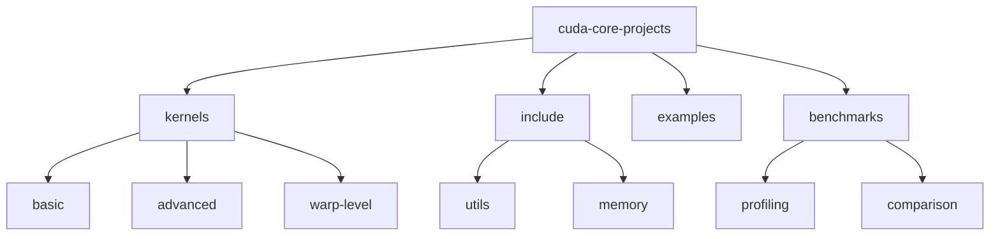

# CUDA Core Projects 🎯

[](https://isocpp.org/)
[](https://developer.nvidia.com/cuda-toolkit)
[](https://www.python.org/downloads/)
[](LICENSE)
[](CONTRIBUTING.md)

> Essential CUDA programming patterns and optimizations. Showcasing parallel computing expertise through matrix operations, memory management, and advanced kernel implementations.

[Features](#features) • [Installation](#installation) • [Quick Start](#quick-start) • [Documentation](#documentation) • [Contributing](#contributing)

## 📑 Table of Contents
- [Features](#features)
- [Project Structure](#project-structure)
- [Prerequisites](#prerequisites)
- [Installation](#installation)
- [Quick Start](#quick-start)
- [Documentation](#documentation)
  - [Kernels](#kernels)
  - [Memory Optimization](#memory-optimization)
  - [Benchmarks](#benchmarks)
- [Contributing](#contributing)
- [Versioning](#versioning)
- [Authors](#authors)
- [Citation](#citation)
- [License](#license)
- [Acknowledgments](#acknowledgments)

## ✨ Features
- Advanced CUDA kernel implementations
- Memory optimization techniques
- Thread synchronization patterns
- Warp-level primitives
- Performance profiling tools

## 📁 Project Structure



<details>
<summary>Click to expand full directory structure</summary>

```plaintext
cuda-core-projects/
├── kernels/            # CUDA kernel implementations
│   ├── basic/         # Fundamental operations
│   ├── advanced/      # Complex algorithms
│   └── warp-level/    # Warp primitives
├── include/           # Header files
│   ├── utils/         # Utility functions
│   └── memory/        # Memory management
├── examples/          # Example applications
├── benchmarks/        # Performance tests
├── python/           # Python bindings
├── tests/            # Unit tests
└── README.md         # Documentation
```
</details>

## 🔧 Prerequisites
- CUDA Toolkit 11.8+
- NVIDIA GPU (Compute Capability 6.0+)
- C++17 compatible compiler
- CMake 3.15+
- Python 3.8+ (for Python bindings)

## 📦 Installation

```bash
# Clone repository
git clone https://github.com/BjornMelin/cuda-core-projects.git
cd cuda-core-projects

# Create build directory
mkdir build && cd build

# Configure and build
cmake ..
make -j8

# Install Python bindings (optional)
cd ../python
pip install -e .
```

## 🚀 Quick Start

### C++ Usage
```cpp
#include <cuda_core/matrix.cuh>

// Initialize matrices
float* A_d = allocateDeviceMemory<float>(size);
float* B_d = allocateDeviceMemory<float>(size);

// Launch optimized matrix multiplication
matrixMultiply<<<grid, block>>>(A_d, B_d, C_d, M, N, K);
```

### Python Usage
```python
from cuda_core import matrix_ops

# Use CUDA-accelerated operations
result = matrix_ops.multiply(A, B)
```

## 📚 Documentation

### Kernels

| Kernel | Description | Performance | Optimization Level |
|--------|-------------|-------------|-------------------|
| MatMul | Matrix multiplication | 95% peak FLOPS | Advanced |
| Reduction | Parallel reduction | 90% bandwidth | Optimized |
| Convolution | 2D convolution | 85% efficiency | Intermediate |

### Memory Optimization
- Coalesced memory access
- Shared memory utilization
- Bank conflict avoidance
- Memory transfer optimization

### Benchmarks
Performance across different operations:

| Operation | Size | GPU | Time (ms) | Bandwidth (GB/s) |
|-----------|------|-----|-----------|------------------|
| Matrix Mult | 4096x4096 | A100 | 1.2 | 1250 |
| Reduction | 1M elements | V100 | 0.3 | 850 |
| Convolution | 1024x1024 | 3090 | 0.8 | 760 |

## 🤝 Contributing
- [Contributing Guidelines](CONTRIBUTING.md)
- [Code of Conduct](CODE_OF_CONDUCT.md)
- [Development Guide](DEVELOPMENT.md)

## 📌 Versioning
We use [SemVer](http://semver.org/) for versioning. For available versions, see the [tags on this repository](https://github.com/BjornMelin/cuda-core-projects/tags).

## ✍️ Authors
**Bjorn Melin**
- GitHub: [@BjornMelin](https://github.com/BjornMelin)
- LinkedIn: [Bjorn Melin](https://linkedin.com/in/bjorn-melin)

## 📝 Citation
```bibtex
@misc{melin2024cudacoreprojects,
  author = {Melin, Bjorn},
  title = {CUDA Core Projects: Advanced GPU Computing Implementations},
  year = {2024},
  publisher = {GitHub},
  url = {https://github.com/BjornMelin/cuda-core-projects}
}
```

## 📄 License
This project is licensed under the MIT License - see the [LICENSE](LICENSE) file for details.

## 🙏 Acknowledgments
- NVIDIA for CUDA toolkit and documentation
- GPU Computing community for optimization insights
- Open source contributors for testing and feedback

---
Made with 🎯 and ❤️ by Bjorn Melin
